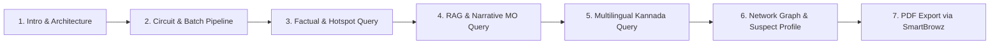

# SAHAYA AI — Hackathon Presentation & Demo Script (60-Hour Datathon)

> **Team**: Yashas (Lead), Gagan, Nikhil Narwankar, Priyanka Jain, Aarush  
> **Platform**: SAHAYA AI — KSP Crime Intelligence & Analytics System  
> **Target Audience**: Datathon Judges, KSP Senior Leadership, Technical Panel  

---

## 🎯 Demo Narrative Flow (Total Duration: 5-7 Minutes)

---

## ⏱️ Step-by-Step Presentation Script

### **Step 1: Introduction & Problem Statement (0:00 - 1:00)**
- **Presenter**: Yashas (Lead)
- **Script**:
  > "Respected judges and officers, welcome to **SAHAYA AI** — an end-to-end, context-aware crime intelligence assistant built specifically for the Karnataka State Police.
  > Police departments handle thousands of FIRs, suspect mapping records, and complex crime networks spread across districts. Extracting actionable insights, predicting emerging crime hotspots, and connecting suspect rings traditionally takes days.
  > SAHAYA AI solves this by combining **predictive machine learning**, **graph analytics**, **multilingual NLP**, and **serverless microservices powered by Zoho Catalyst**."

---

### **Step 2: Circuit & Batch Analytics Recompute (1:00 - 2:00)**
- **Presenter**: Nikhil / Yashas
- **Action**: Show terminal or Catalyst AppSail circuit execution log.
- **Script**:
  > "Behind the scenes, our **Catalyst AppSail container** runs a Python batch analytics pipeline built with NetworkX, scikit-learn, and statsmodels.
  > On a scheduled circuit trigger, it ingests FIR records, builds suspect connection graphs, detects connected criminal rings, calculates Z-score anomaly spikes, and generates spatiotemporal forecasts.
  > Notice how it automatically identified **6 distinct crime rings** and **8 critical anomaly spikes** (e.g., Murder surge in Kalaburagi and Drug trafficking spikes in Mysuru)."

---

### **Step 3: Factual Statistical Query (2:00 - 3:00)**
- **Presenter**: Gagan
- **Action**: Open Chat Interface (`http://localhost:3000/`) and ask a statistical query.
- **Query**: `"Which district in Karnataka has the highest theft cases?"`
- **What to highlight**:
  - **Fast intent routing** (`fact` intent path).
  - Accurate data retrieval from Catalyst Data Store / `hotspot_answers.json`.
  - Display of statistics, total cases, and district rankings.
  - **Explainability Panel**: Show the reasoning trace proving data source origin.

---

### **Step 4: RAG Narrative & Case MO Analysis (3:00 - 4:00)**
- **Presenter**: Priyanka
- **Action**: Type a narrative MO query.
- **Query**: `"Summarize recent house burglary cases in Indiranagar and explain the suspect modus operandi."`
- **What to highlight**:
  - **RAG Intent Routing**: QuickML Knowledge Base semantic retrieval over unstructured case narratives.
  - Summarized MO details (nighttime entry, lock picking, target valuables).
  - Source citations linking directly to FIR numbers (`FIR-2024-0012`, `FIR-2024-0045`).

---

### **Step 5: Multilingual Kannada Voice Query (4:00 - 5:00)**
- **Presenter**: Aarush
- **Action**: Click the Microphone button (or type Kannada text query).
- **Query**: `"ಬೆಂಗಳೂರಿನಲ್ಲಿ ಹೆಚ್ಚಿನ ಕಳ್ಳತನ ಪ್ರಕರಣಗಳು ಯಾವ ಜಿಲ್ಲೆಯಲ್ಲಿ?"`
- **What to highlight**:
  - **Zia Speech-to-Text & Translation**: Automatic Kannada script detection and English NLP translation.
  - Seamless response rendering with dual English analytical details + **ಕನ್ನಡ ಅನುವಾದ (Kannada Summary)**.
  - Text-to-Speech (TTS) audio playback reading answer aloud in Indian English locale.

---

### **Step 6: Suspect Network Graph & Profile Deep-Dive (5:00 - 6:00)**
- **Presenter**: Aarush / Team
- **Action**: Click on "Suspect Network Graph" tab or ask `"Show suspect network for Crime Ring 1"`.
- **What to highlight**:
  - **Force-directed 2D Graph** rendered with `react-force-graph-2d`.
  - Node color coding by risk level (High Risk = Red, Medium = Amber, Low = Green).
  - Interactive node clicking: Clicking a suspect opens their complete criminal profile, past FIR history, and Zia AutoML risk score.

---

### **Step 7: Catalyst SmartBrowz PDF Report Export & Wrap-up (6:00 - 6:30)**
- **Presenter**: Yashas
- **Action**: Click **"Print PDF"** on the Reports page or **"Export Session"** in Chat header.
- **What to highlight**:
  - **Catalyst SmartBrowz Integration**: Instant generation of official police intelligence dossiers.
  - Wrap-up summary: 100% full coverage of Catalyst Services (Functions, AppSail, Data Store, Cache, QuickML, Zia, SmartBrowz).

---

## ⚡ Technical Backup & Troubleshooting Cheat Sheet

| Situation | Instant Recovery Action |
|---|---|
| API Gateway Latency | Click **"Ping Catalyst API (Warm Up)"** in Settings modal 5 min before demo. |
| Microphone permission blocked | Use pre-configured Kannada suggested query button below chat input. |
| Network disconnect | System automatically switches to bundled local JSON engine without breaking UI. |

---

## 🏆 Catalyst Services Demonstrated

1. **Functions**: Advanced I/O routing serverless backend (`/api/chat`).
2. **AppSail**: Dockerized Python runtime executing NetworkX & forecasting pipeline.
3. **Data Store**: Relational schemas for FIRs, Suspects, Victims, and Hotspots.
4. **Cache**: High-speed session memory and context resolution.
5. **QuickML**: Knowledge Base semantic RAG over case narratives.
6. **Zia Services**: Multilingual Kannada translation & Speech-to-Text.
7. **SmartBrowz**: Headless PDF rendering for official dossiers.
