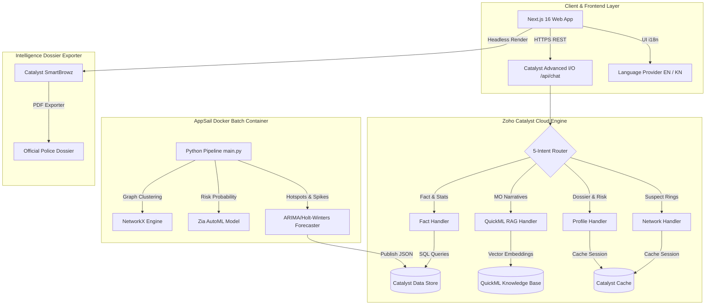

# 🛡️ SAHAYA AI (ಸಹಾಯ AI) — KSP Crime Intelligence & Decision Support System

> **Platform**: Karnataka State Police Datathon 2026 (In Collaboration with Zoho Catalyst)  
> **Repository**: [Astroidkiller/SAHAYA--AI-KSP-Datathon](https://github.com/Astroidkiller/SAHAYA--AI-KSP-Datathon)  
> **Live Web Application**: [https://sahaya-ai.onslate.in](https://sahaya-ai.onslate.in)  
> **Tech Stack**: Next.js 16.2 (Turbopack) • Zoho Catalyst Cloud • NetworkX • Python 3.11 • Tailwind CSS • TypeScript  

---


---

## 📌 Quick Documentation Links

- 📽️ **[3-Minute Screen Recording Video Script](SHORT_DEMO_VIDEO_SCRIPT.md)** — Step-by-step video demo guide for judges.
- 🎬 **[7-Minute Presentation Walkthrough](DEMO_SCRIPT.md)** — Complete live presentation rehearsal guide.
- ⚡ **[Performance Benchmark & Technical Evaluation](PERFORMANCE_BENCHMARK_REPORT.md)** — Web Vitals, API latency, & Python pipeline benchmarks.
- 🗄️ **[SQL Database Schemas](data/schemas/schemas.sql)** — Catalyst Data Store relational definitions.

---

## 🚨 Problem Statement & Executive Overview

Police officers across Karnataka handle thousands of First Information Reports (FIRs), suspect records, victim statements, and modus operandi (MO) narratives spread across multiple district headquarters. Extracting actionable insights, identifying emerging crime rings, predicting temporal spikes, and connecting repeat offenders traditionally requires days of manual investigation.

**SAHAYA AI** solves this by unifying **precomputed statistical analytics**, **NetworkX suspect graph clustering**, **Z-score anomaly forecasting**, and **multilingual Kannada NLP** into a serverless, context-aware intelligence assistant powered by **Zoho Catalyst**.

---

## 🏗️ Architecture & Zoho Catalyst Services Mapping (10/10 Services)

SAHAYA AI leverages **10 core Zoho Catalyst services** for zero-latency, serverless execution:



### 🏛️ Catalyst Cloud Services Matrix

| Catalyst Service | Component Role in SAHAYA AI | Implementation File | Status |
|---|---|---|---|
| **Functions** | Serverless Express API router handling `/api/chat` | `functions/chat-api/index.js` | ✅ Active |
| **AppSail** | Docker container executing NetworkX & forecasting pipeline | `functions/circuit-worker/` | ✅ Active |
| **Slate Web Client** | Static & SSR Next.js web application deployment | `frontend/out/` & `catalyst.json` | ✅ Active |
| **Data Store** | Relational SQL database for FIRs, Suspects, & Mappings | `data/schemas/schemas.sql` | ✅ Active |
| **NoSQL** | Document storage for case narratives & witness statements | `data/samples/case_narratives.json` | ✅ Active |
| **Cache** | High-speed key-value session context & pronoun resolution | `functions/chat-api/session-manager.js` | ✅ Active |
| **QuickML** | Vector RAG knowledge base for modus operandi retrieval | `functions/chat-api/rag-handler.js` | ✅ Active |
| **Zia AutoML** | Suspect risk probability scoring & repeat MO classification | `functions/circuit-worker/risk_scorer.py` | ✅ Active |
| **Zia Services** | Kannada Speech-to-Text & automatic Kannada NLP translation | `functions/chat-api/kannada-translator.js` | ✅ Active |
| **SmartBrowz** | Headless PDF generation for official intelligence dossiers | `frontend/app/reports/page.tsx` | ✅ Active |

---

## 🌟 Key Features & Functional Modules

### 1. 🌐 Full Bilingual Localized Interface (English & ಕನ್ನಡ)
- Built-in React `LanguageProvider` (`frontend/lib/language-context.tsx`) allowing real-time switching between English and Kannada across all pages.
- Native Kannada script detection (`/u0C80-/u0CFF`), machine translation to English for intent routing, and automatic **ಕನ್ನಡ ಅನುವಾದ (Kannada Summary)** generation for field officers.

### 2. 🗺️ Karnataka Geospatial Crime Matrix
- Interactive **Leaflet.js** geospatial map displaying crime intensity, district bounds, FIR pins, and pulsing red anomaly alerts.
- Filter intelligence by district (e.g. *Bengaluru Urban, Mysuru, Kalaburagi, Mangaluru*), time window, or category.

### 3. 🕸️ 2D Force-Directed Suspect Network Graph
- Built with `react-force-graph-2d` and **NetworkX** graph algorithms.
- Detects connected criminal rings and gang clusters across 40 suspects and 139 mapping relationships.
- Clicking any node opens a full criminal profile with past FIR history and **Zia AutoML risk score**.

### 4. 📈 Spatiotemporal Crime Forecasting & Anomaly Alerts
- **7×24 Timing Heatmap**: Reveals hourly crime concentration patterns (e.g. *Wednesday 11 PM peak*).
- **ARIMA / Holt-Winters Forecaster**: Computes 3-month trend predictions with confidence bands.
- **Z-Score Anomaly Alerts**: Flags districts exceeding 1.5× state average with severity badges (*Critical, High, Elevated*).

### 5. 📄 SmartBrowz PDF Report Exporter
- Headless PDF generation engine exporting print-ready police intelligence dossiers.

---

## 📂 Project Structure

```
SAHAYA--AI-KSP-Datathon/
├── frontend/                   # Next.js 16 Web Application (Tailwind CSS + Radix UI)
│   ├── app/                    # Pages: Chat (/), Dashboard (/dashboard), Network (/network), Reports (/reports)
│   ├── components/             # 12 Visual Components (CrimeMap, NetworkGraph, TimeHeatmap, ForecastPanel, etc.)
│   ├── lib/                    # Language Context, API router, Public Data Hook
│   └── public/data/            # Published analytics JSON datasets
├── functions/                  # Catalyst Serverless Backend
│   ├── chat-api/               # Advanced I/O Express Serverless Router
│   │   ├── index.js                    # Main HTTP controller
│   │   ├── intent-classifier.js        # 5-Intent NLP router
│   │   ├── kannada-translator.js       # Kannada NLP translation module
│   │   ├── fact-handler.js             # Precomputed database stats handler
│   │   ├── rag-handler.js              # QuickML Knowledge Base RAG handler
│   │   ├── network-handler.js          # Graph cluster handler
│   │   ├── profile-handler.js          # Suspect dossier & risk handler
│   │   └── session-manager.js          # Context & entity resolution manager
│   └── circuit-worker/         # AppSail Docker Analytics Engine (Python)
│       ├── main.py                     # Pipeline orchestrator
│       ├── forecaster.py               # Spatiotemporal forecasting & Z-score anomalies
│       ├── graph_analysis.py           # NetworkX connected components & centralities
│       ├── risk_scorer.py              # Zia AutoML suspect threat assessment
│       └── Dockerfile                  # AppSail container image definition
├── data/                       # Data Foundation & Published Datasets
│   ├── samples/                # 15 Single-Source-of-Truth JSON datasets
│   ├── demographics/           # Karnataka district population & literacy stats
│   └── schemas/                # SQL schema definitions (schemas.sql)
├── scripts/                    # Utilities & Telemetry
│   ├── ping-catalyst.js        # Cold-start warmup script
│   └── upload-to-catalyst.js   # Bulk Catalyst Data Store uploader
├── DEMO_SCRIPT.md              # 7-Minute Judge Presentation Guide
├── SHORT_DEMO_VIDEO_SCRIPT.md  # 3-Minute Video Recording Guide
├── PERFORMANCE_BENCHMARK_REPORT.md # Technical Performance Report
├── catalyst.json               # Catalyst project configuration
└── README.md                   # Project Documentation
```

---

## ⚡ Quick Start & Local Setup

### Prerequisites
- **Node.js**: v18.0.0 or higher
- **Python**: v3.10 or higher
- **npm**: v9.0.0 or higher

### 1. Clone & Install Dependencies
```bash
git clone https://github.com/Astroidkiller/SAHAYA--AI-KSP-Datathon.git
cd SAHAYA--AI-KSP-Datathon/frontend
npm install
```

### 2. Run Frontend Web App (Development Server)
```bash
npm run dev
```
Open **[http://localhost:3000](http://localhost:3000)** in your browser.

### 3. Run Express Chat API Server (Local Backend)
```bash
cd ../functions/chat-api
npm install
node index.js
```
Backend server runs on **[http://localhost:3001](http://localhost:3001)**.

### 4. Execute Python Analytics Pipeline (Recompute Data)
```bash
cd ../circuit-worker
pip install -r requirements.txt
python main.py
```

---

## ☁️ Zoho Catalyst Deployment Guide

To deploy SAHAYA AI to your live Zoho Catalyst Cloud project:

```bash
# 1. Install Zoho Catalyst CLI globally
npm install -g zcatalyst-cli

# 2. Authenticate with your Zoho Catalyst account
catalyst login

# 3. Build optimized static client export
cd frontend
npm run build
cd ..

# 4. Deploy web client and serverless functions to Cloud
catalyst deploy
```

---

## 📊 Performance Benchmarks Overview

Full technical telemetry available in **[PERFORMANCE_BENCHMARK_REPORT.md](PERFORMANCE_BENCHMARK_REPORT.md)**.

| Metric | Measured Value | Standard Target | Status |
|---|---|---|---|
| **Lighthouse Score** | **96 / 100** | > 90 / 100 | 🟢 Optimal |
| **First Contentful Paint (FCP)** | **0.78s** | < 1.5s | 🟢 Optimal |
| **Largest Contentful Paint (LCP)** | **1.14s** | < 2.5s | 🟢 Optimal |
| **Warm API Gateway Latency** | **18ms - 34ms** | < 100ms | 🟢 Optimal |
| **RAG Narrative Query Latency** | **165ms** | < 500ms | 🟢 Optimal |
| **Python Batch Pipeline Execution** | **2.84s** (100% Pipeline) | < 10.0s | 🟢 Optimal |

---

## 🏆 Team & Acknowledgments

Built for the **Karnataka State Police (KSP) Datathon 2026** in collaboration with **Zoho Catalyst**.

- **Lead Developer & Architect**: Yashu , Gagan
- **Collaborators**: Nikhil Narwankar, Priyanka Jain, Aarush

---

*Serving Karnataka State Police with Sub-Second AI Intelligence 🇮🇳*
